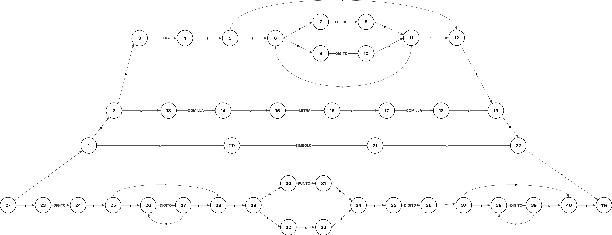

# Tabla de Transiciones Scanner (con float y char)
Cosas que debe reconocer el scanner: 
- ID: [A-Za-z][A-Za-z0-9]*  
*Luego, si el lexema es inicio|fin|leer|escribir|mientras|si|repetir|hasta,  se remapea a palabra reservada.*
- CHAR: ' [A-Za-z] '
- CONSTANTE (entero): [0-9]+
- FLOAT: [0-9]+ . [0-9]+
- SUMA: +
- RESTA: -
- PARENIZQUIERDO: (
- PARENDERECHO: )
- COMA: ,
- PUNTOYCOMA: ;
- ASIGNACION: :=

**Expresion Regular:**
LETRA•(DIGITO+LETRA)* + COMILLA•LETRA•COMILLA + DIGITO⁺•PUNTO?•DIGITO* + SUMA + RESTA + PARENIZQUIERDO + PARENDERECHO + COMA + PUNTOYCOMA + ASIGNACION

**Gramatica:**
S   →   LETRA T  +  DÍGITO W  +  COMILLA U  +  Y
T   →   LETRA T + DÍGITO T + ε
U   →   LETRA V
V   →   COMILLA
W   →   DÍGITO X  +  ε  +  PUNTO X
X   →   DÍGITO X  +  ε
Y   →   SUMA + RESTA + PARENIZQUIERDO + PARENDERECHO + COMA + PUNTOYCOMA + ASIGNACION

ε:                  palabra vacía
DIGITO:             [0-9]
LETRA:              [A-Za-z]
SUMA:               +
RESTA:              -
PARENIZQUIERDO:     (
PARENDERECHO:       )
COMA:               ,
PUNTO:              .
PUNTOYCOMA:         ;
ASIGNACION:         :=
COMILLA:            '

**AFN por Thompson**

PROCESO: [ ☞ Quiero ver el paso a paso ☜ ](https://lucid.app/lucidchart/c8d4739e-63a3-4f15-bd5f-f3cc112b7681/edit?viewport_loc=-2245%2C9167%2C7005%2C3129%2C0_0&invitationId=inv_2762dfa5-ea7a-452b-a91d-8a1e2cca0764)

RESULTADO: 

**SINTAXIS SENTENCIAS NUEVAS**
Sentencia   →   Asignacion | Leer | Escribir | Mientras | Si | Repetir
Mientras    →   "mientras" ( Expresion ) "inicio" ListaSentencias "fin"
Si          →   "si" Expresion "inicio" ListaSentencias "fin"
Repetir     →   "repetir" ListaSentencias "hasta" "(" Expresion ")"

# Tabla Original
| Estado | LETRA | Dígito | + | - | ( | ) | , | ; | : | = | EOF | Espacio | Otro |
|------:|:----:|:-----:|:-:|:-:|:-:|:-:|:-:|:-:|:-:|:-:|:---:|:------:|:----:|
| 0 | 1 | 3 | 5 | 6 | 7 | 8 | 9 | 10 | 11 | 14 | 13 | 0 | 14 |
| 1 | 1 | 1 | 2 | 2 | 2 | 2 | 2 | 2 | 2 | 2 | 2 | 2 | 2 |
| 2 | 14 | 14 | 14 | 14 | 14 | 14 | 14 | 14 | 14 | 14 | 14 | 14 | 14 |
| 3 | 4 | 3 | 4 | 4 | 4 | 4 | 4 | 4 | 4 | 4 | 4 | 4 | 4 |
| 4 | 14 | 14 | 14 | 14 | 14 | 14 | 14 | 14 | 14 | 14 | 14 | 14 | 14 |
| 5 | 14 | 14 | 14 | 14 | 14 | 14 | 14 | 14 | 14 | 14 | 14 | 14 | 14 |
| 6 | 14 | 14 | 14 | 14 | 14 | 14 | 14 | 14 | 14 | 14 | 14 | 14 | 14 |
| 7 | 14 | 14 | 14 | 14 | 14 | 14 | 14 | 14 | 14 | 14 | 14 | 14 | 14 |
| 8 | 14 | 14 | 14 | 14 | 14 | 14 | 14 | 14 | 14 | 14 | 14 | 14 | 14 |
| 9 | 14 | 14 | 14 | 14 | 14 | 14 | 14 | 14 | 14 | 14 | 14 | 14 | 14 |
| 10 | 14 | 14 | 14 | 14 | 14 | 14 | 14 | 14 | 14 | 14 | 14 | 14 | 14 |
| 11 | 14 | 14 | 14 | 14 | 14 | 14 | 14 | 14 | 14 | 12 | 14 | 14 | 14 |
| 12 | 14 | 14 | 14 | 14 | 14 | 14 | 14 | 14 | 14 | 14 | 14 | 14 | 14 |
| 13 | 14 | 14 | 14 | 14 | 14 | 14 | 14 | 14 | 14 | 14 | 14 | 14 | 14 |
| 14 | 14 | 14 | 14 | 14 | 14 | 14 | 14 | 14 | 14 | 14 | 14 | 14 | 14 |
